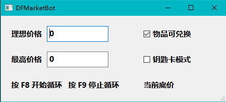
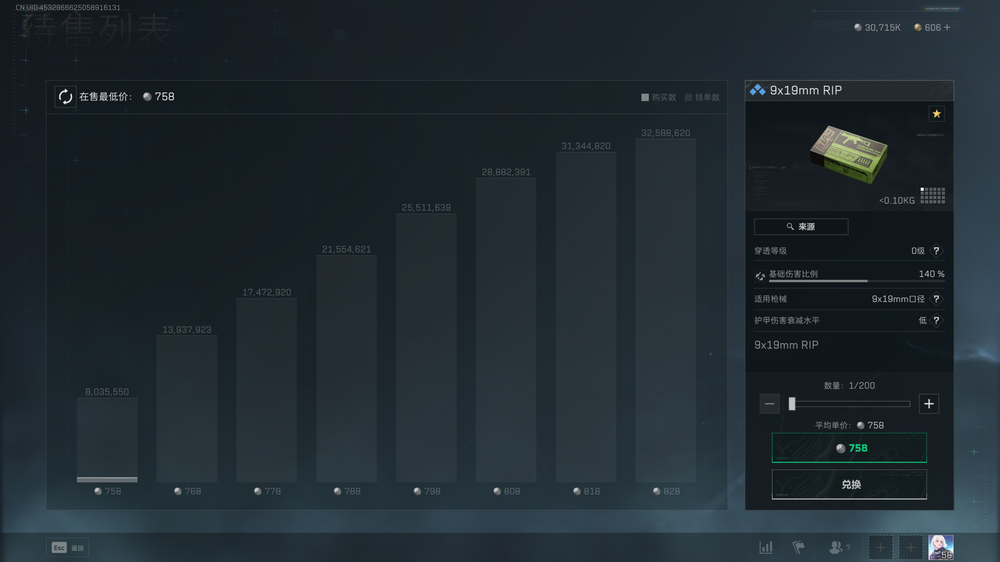

# DeltaForceMarketBot

用于腾讯三角洲行动游戏内交易行的抢子弹工具，

# 部署

下载代码，安装requirements.txt

# 运行

```python
python DFMarketBot.py
```

等待命令行中显示''初始化完成''

启动循环前先输入理想价格（最高价格相关功能还没做，纯摆设）↓



进入要买的物品的页面↓



F8启动循环开始自动购买，F9停止循环

# 购买逻辑

如果子弹底价低于理想价格就买200发

如果子弹底价高于理想价格就买1发来刷新价格

如果子弹底价高于最高价格就重进商品页面刷新价格

# 画饼

钥匙卡模式

底价超出最高价格时免费刷新

# 免责声明

脚本仅供学习和研究目的使用，作者不对因使用该脚本而导致的任何后果负责。使用该脚本的风险完全由用户自行承担。

用户须知：

尽管脚本设计为非侵入性，但使用第三方工具可能违反目标平台的使用条款或服务协议。 使用该脚本可能导致账号被封禁或其他形式的处罚。

作者不保证脚本的稳定性、安全性或合法性。

# 感谢

[sheldon1998/DeltaForceKeyBot](https://github.com/sheldon1998/DeltaForceKeyBot)：提供了思路
