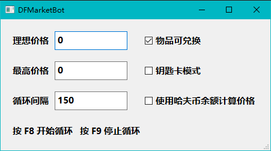

# DeltaForceMarketBot

用于腾讯三角洲行动游戏内交易行的市场工具

# 部署

下载代码，安装requirements.txt

# 运行

```python
python DFMarketBot.py
```

**等待命令行中显示''初始化完成''**

**启动循环前先输入理想价格和最高价格↓（循环间隔150是推荐值，越大越稳定，调小可能会出现手比眼睛快的情况）**



**先切换到三角洲游戏内**

**再进入商店页面把鼠标放在要买的物品上**

**然后按F8启动循环开始自动购买，按F9停止循环**

# 购买逻辑

## 正常模式

如果底价高于最高价格就重进商品页面刷新价格

如果底价高于理想价格就买31发来刷新价格

如果底价低于理想价格就买200发

## 钥匙卡模式

如果底价高于理想价格就重进商品页面刷新价格

如果底价低于理想价格就买1张，然后结束循环

# 关于使用哈夫币余额计算价格

由于刚刚推出这个功能，所以如果使用过程中有问题欢迎开issue留言。

这个模式主要是通过识别并计算哈夫币余额来对实际平均成交价格进行计算，

在哈夫币余额模式下，购买逻辑中的底价会使用平均哈夫币余额差值来进行替代，更接近实际成交价格，可以帮助用户在价格柱子被隐藏时执行购买。

# 已知问题

免费刷新时可能出现找不到原商品的情况，因为在商品页面里待久了之后，返回商店页面时滚动条会回到最上面。

钥匙卡模式理论上不受影响，因为会频繁进出商品页面，不会使商店滚动条回到最上方

临时解决方法是在非钥匙卡模式下把最高价格调高，使免费刷新功能不被触发

# 画饼

~~钥匙卡模式~~

~~底价超出最高价格时免费刷新~~

钥匙卡数量选择

打包exe

# 免责声明

脚本仅供学习和研究目的使用，作者不对因使用该脚本而导致的任何后果负责。使用该脚本的风险完全由用户自行承担。

用户须知：

尽管脚本设计为非侵入性，但使用第三方工具可能违反目标平台的使用条款或服务协议。 使用该脚本可能导致账号被封禁或其他形式的处罚。

作者不保证脚本的稳定性、安全性或合法性。

# 感谢

[sheldon1998/DeltaForceKeyBot](https://github.com/sheldon1998/DeltaForceKeyBot)：提供了思路
